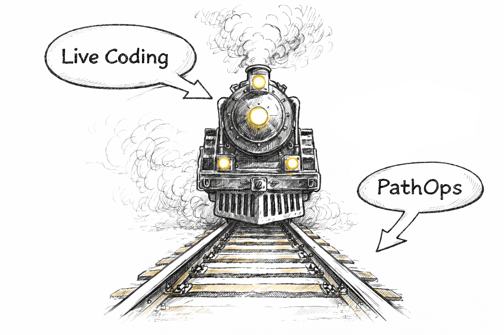

# PathOps



## Rails for live coding in production

PathOps is the control plane that keeps AI-assisted development **safe, auditable, and deployable**.

Live coding is powerful — but without rails, it can derail.
PathOps provides those rails.


## How it works

### Live coding with guardrails  
AI agents propose changes on branches. Nothing reaches production without pull requests and checks.

### GitOps + preflight  
Merges promote to a *preflight* environment via Argo CD. The system validates reality.

### Evidence + recovery  
Failures generate snapshots (logs, events, metrics). PathOps proposes recovery PRs.


## Why PathOps

- Opinionated golden paths designed for AI speed
- Pull-request–first delivery
- Evidence-driven promotion to production
- Automated rollback and recovery via PRs
- Works with your existing tools


## Open source by design

PathOps is fully open source.
All actions are visible, reviewable, and auditable.


## Demo

### Live demo

Try PathOps live at:

https://demo.pathops.io


### Video demo

Watch the walkthrough:

https://www.youtube.com/watch?v=YOUR_VIDEO_ID


### Quickstart (example)

```bash
# install CLI (example)
curl -fsSL https://pathops.io/install.sh | bash

# bootstrap
pathops login
pathops bootstrap cluster-a
pathops create project shop

# create apps
pathops create app backend --stack spring-boot
pathops create app frontend --stack react
```

## Links

- Manifesto: (./docs/manifesto.md) 
- Docs: - (./docs/) 
- GitHub: (https://github.com/orgs/PathOps/repositories)
- Demo: (https://demo.pathops.io)
