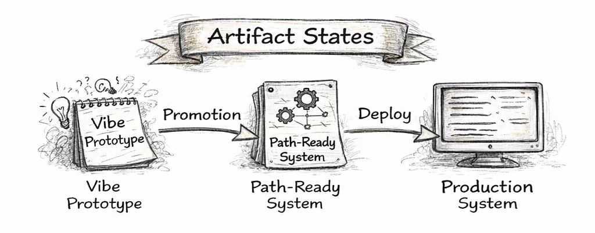

# [Docs](./README.md)
# Artifact States

PathOps treats software artifacts as **stateful entities**.

An artifact does not magically become “production-ready”.
It **moves through explicit states**, each with different expectations,
capabilities, and risks.

This document defines those states and the transitions between them.

---

## The Artifact Lifecycle

PathOps recognizes three primary artifact states:

1. **Vibe Prototype**
2. **Path-Ready System**
3. **Production System**

Each state exists for a reason.
Skipping states is a source of instability.

---

## 1) Vibe Prototype

A **Vibe Prototype** is the result of exploratory development.

It may be created by:
- vibe coding
- spikes
- experiments
- AI-assisted exploration
- quick scripts or proofs of concept

### Characteristics

- Optimized for **discovery**, not longevity
- Structure may be rough or inconsistent
- May mix concerns (logic, UI, data, scripts)
- May be incomplete or fragile
- May be discarded at any time

### What PathOps assumes

- The prototype is **not safe to deploy**
- The prototype has **no guarantees**
- The prototype has **no rollback expectations**

This is acceptable.

> Exploration is allowed to be messy.

---

## 2) Path-Ready System

A **Path-Ready System** is an artifact that has been
**intentionally promoted** into a governed lifecycle.

This is the most important transition in PathOps.

### How an artifact becomes Path-Ready

Promotion is a **decision**, not an automated step.

It implies:

- The artifact is worth keeping
- The artifact will evolve over time
- Changes must be survivable

### Minimum expectations

A Path-Ready System must have:

- **Explicit intent**
  - What this system is for
  - What kind of changes are expected

- **Ownership**
  - A maintainer responsible for decisions

- **Reversibility**
  - A defined rollback or disable path

- **Boundaries**
  - Clear scope of what can change safely

Perfection is **not required**.
Stability is **not required**.
Only evolvability is required.

> Path-Ready does not mean “clean”.
> It means “changeable without chaos”.

---

## 3) Production System

A **Production System** is a deployed artifact
operating under real user and operational conditions.

### Characteristics

- Serves real users or workloads
- Emits signals (metrics, logs, alerts)
- Is subject to failures and incidents
- Is observed, not trusted blindly

### What Production does NOT do

- Production does **not** decide changes
- Production does **not** apply fixes
- Production does **not** execute rollbacks by itself

### What Production DOES do

- Detect failures
- Emit alerts
- Produce operational signals

> Production signals. Paths act.

---

## Transitions Between States

### Vibe Prototype → Path-Ready System  
**Promotion**

Promotion is intentional.

It happens when someone says:
> “We want to keep this, and we accept responsibility for its evolution.”

This transition:
- introduces guards
- enables governed change
- allows live evolution

---

### Path-Ready System → Production System  
**Deploy**

Deployment happens through a defined path:
- pull requests
- evidence
- checks
- GitOps reconciliation

Promotion without evidence is not allowed.

---

### Production System → Path-Ready System  
**Incident / Failure**

When production detects a problem:
- it emits a signal
- it triggers a path

The path may:
- roll back
- disable a feature
- restore a known-good state
- propose a recovery PR

Production never acts directly.

---

## Why These States Matter

Without explicit artifact states:

- Prototypes leak into production
- Changes become irreversible
- Failures become emergencies
- Responsibility becomes unclear

PathOps uses artifact states to ensure that:

- exploration remains free
- evolution remains safe
- production remains observable

---

## Summary

- **Vibe Prototypes** explore ideas
- **Path-Ready Systems** evolve safely
- **Production Systems** run and signal

PathOps exists to manage the transitions —
not to eliminate experimentation.

> Change is inevitable.  
> Chaos is optional.