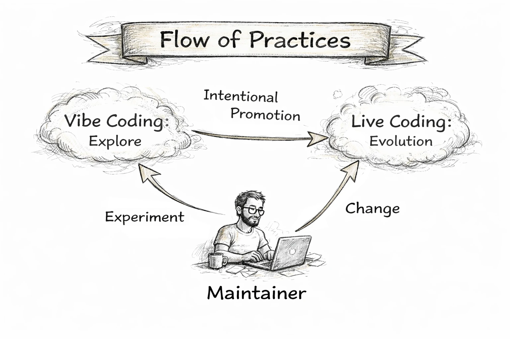

# [Docs](./README.md) 
# PathOps Manifesto
**Rails for live coding in production.**

AI-assisted “live coding” is a locomotive: fast, powerful, and transformative.  
But speed without rails becomes risk.

PathOps exists to keep AI-powered development **on track** — from intent to production — using auditable change, evidence, and guardrails.

---

## The promise

PathOps turns intent into **safe, reviewable, production-grade change**.

It does so by enforcing a simple rule:

> **No change reaches production without evidence.**  
> Evidence is produced by the system: tests, deploy outcomes, runtime signals, and policy checks.

PathOps does not “patch production”.  
PathOps proposes changes via pull requests.

---

## The problem

Live coding tools can:
- generate impressive solutions quickly
- iterate at high speed
- unlock new productivity

But they can also:
- hallucinate APIs
- drift from architecture
- break invariants silently
- introduce security regressions
- ship changes without sufficient verification

Traditional CI/CD was designed for human-paced change.  
AI changes are faster, broader, and easier to misjudge.

---

## The PathOps approach

PathOps is a control plane that coordinates:

- **Golden paths**: opinionated workflows that work well under AI speed
- **PR-first change**: every modification is a PR (human-reviewable, auditable)
- **GitOps deployment**: the cluster is driven by declared state
- **Evidence snapshots**: “what happened” captured as a portable bundle
- **Autopilot PRs**: when failures happen, propose a fix PR with context

PathOps makes production behavior part of the feedback loop.

---

## The mental model

- **Live coding** is the locomotive.
- **PathOps** are the rails.

PathOps does not reduce power.  
PathOps reduces derailments.

---

### Flow of Practices

PathOps recognizes two complementary practices:

- **Vibe Coding** for exploration and discovery
- **Live Coding** for intentional evolution

Vibe Coding ≠ delivery.   
Live Coding = evolution. 

Exploration is allowed.
Evolution is governed.

---

## What PathOps optimizes for

1. **Trust through visibility**  
   If the system acts, it must be explainable and reviewable.

2. **Safety with speed**  
   The goal is frequent delivery without fragile delivery.

3. **Evidence-driven decisions**  
   Promotions are based on signals, not hope.

4. **Reversibility**  
   Every change must have a rollback path.

5. **Minimalism**  
   Prefer two reliable paths over ten configurable paths.

---

## What PathOps enables

- Fast iteration with AI coding tools **without losing control**
- A simple pipeline that promotes to a **preflight** environment
- Automated post-deploy checks that validate reality
- Incidents that produce **evidence bundles**
- Recovery that happens via **PRs**, not hidden patches

---

## The stance

PathOps is opinionated.

If a feature makes PathOps faster but less trustworthy, it does not belong.  
If it makes AI safer for production, it does.

---

## The long-term vision

PathOps is not a replacement for teams.  
It is a structure that allows teams — and AI — to move quickly without falling off the track.

**Rails matter.**

